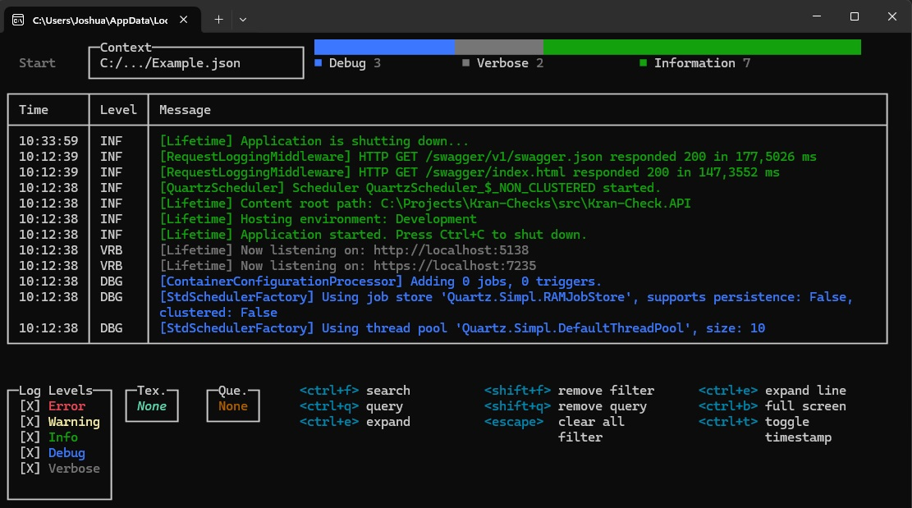

# ClefViewer




**ClefViewer** is a command line tool to parse and view `CLEF (Compact Log Event Format)` entries on the console.
It provides efficient filtering and querying with [Serilog Expression Syntax](https://github.com/serilog/serilog-expressions).

## Getting started

### Download

Download the [latest release](https://github.com/joshua211/ClefViewer/releases) and add the executable to your PATH.

## Usage

Run the tool with the path to the CLEF file as the first argument:

```shell
clefviewer mylogfile.json
```
